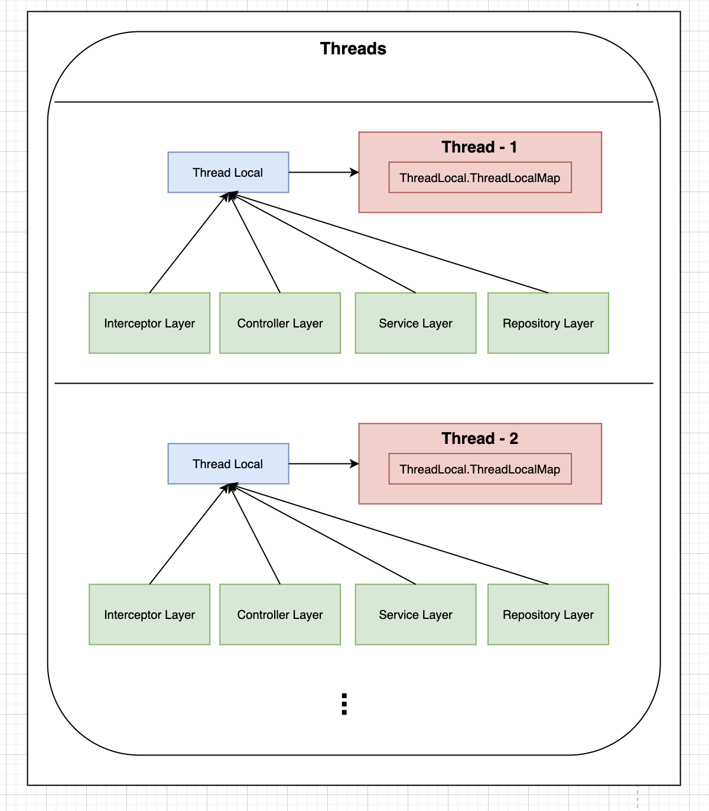

# 📚Thread Local 

---

## Thread Local의 필요성

---

Spring 의 패턴으로 예를 들면 Layer간 어떠한 값을 접근하기위해서는 다양한 방법이 존재한다.

1) Layer간 메서드 Paramter로 넘겨서 접근하기
    1) 문제점   
       - 다수의 leyer에서 공통적으로 사용하는 어떠한 값이 있다면 layer 객체간 소통을 할 때 이 어떠한 값을 parameter로 넘기면서 중복코드가 다수 발생된다.
       - layer간 각 layer가 책임질 필요 없는 parameter를 받게 될 경우가 생긴다.
2) 클래스의 public static 멤버 변수로 선언해서 접근하기
   1) 문제점
       - layer 간 Parameter를 넘겨서 접근하는 방법보다는 더 효율적이지만 해당 값이 mutable 한다면 멀티스레드 환경에서 동시성 문제에 직면할 수 있다.

> Thread Local을 이용한 layer간 특정 데이터를 접근

---

## Thread Local 동작
>
>Thread Local 은 Layer간 현재 수행중인 Thread 한정의 local 변수를 선언해 동일한 스레드 내의 처리라면 어느 Layer 든 local 변수에 접근이 가능하게 해주는 Thread의 local 변수를 컨트롤하는 Handler 클래스라고 보면 된다.  
> local 변수이기 때문에 메서드 블록이 끝나면 제거되는 일반적인 local 변수와 비슷하게 현재 수행중이던 스레드가 종료되면 Thread Local 변수도 삭제된다.

`
단, 일반적으로 Thread pool을 사용하는 WAS 환경에서는 Thread 를 사용완료 후 Thread는 종료되지 않고 pool에 반납만 되기 때문에 Thread 사용이 완료됐다면 Thread local 변수를 다음 요청을 위해서 초기화 시켜줘야한다.)
`

### 결과

---

## ⛓️참고자료

- https://hwannny.tistory.com/95
- https://coding-start.tistory.com/117

---